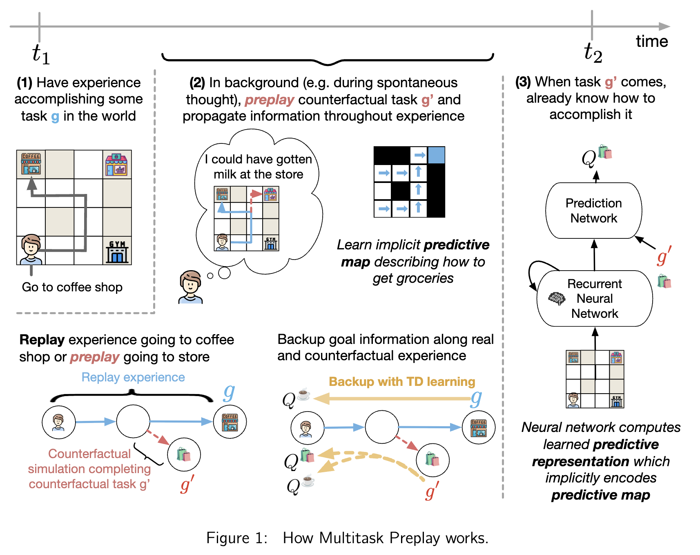

# Multitask Preplay
This repository is the official implementation of [Preemptive Solving of Future Problems: Multitask Preplay in Humans and Machines](link).

**Table of Contents**

- [Install](#install)
- [Analysis on paper data](#analysis-on-paper-data)
- [Running web experiments](#running-web-experiments)
  - [JaxMaze experiment](#jaxmaze-experiment)
  - [Craftax experiment](#craftax-experiment)
- [Data Folder Structure](#data-folder-structure)




## Install
```bash

# clone with submodules (needed for simulation folder)
git clone --recurse-submodules https://github.com/wcarvalho/multitask_preplay.git
cd multitask_preplay


# Install uv if you haven't already
curl -LsSf https://astral.sh/uv/install.sh | sh

# Create environment and install dependencies with uv
uv sync --python 3.11
source .venv/bin/activate
```

## Analysis on paper data

Open `jupyter lab` from the root directory.

Use the following notebooks for getting plots:
* **JaxMaze analysis**: `figures/jaxmaze_results.ipynb`
* **Craftax analysis**: `figures/craftax_cogsci_results.ipynb`

Running these notebooks will automatically download any necessary data. You can also view this data and the preregistration for the JaxMaze experiments at the Open Science Foundation repositories
* JaxMaze: https://doi.org/10.17605/OSF.IO/M53QH
* Craftax: https://doi.org/10.17605/OSF.IO/B2EVM

**Settings directory for data**.
Defaults to `../preplay_results`. If you want to change it, either manually set the `DIRECTORY` variable in `data_configs.py` or set the environment variable `MULTITASK_PREPLAY_DATA_DIR`. 

```bash
export MULTITASK_PREPLAY_DATA_DIR="/path/to/data"
```

## Running web experiments


Here, we describe how to do **local testing**. In [this file](online_web_experiments.md), we describe how to launch things with fly.io.

Note: before running a new experiment you want to delete `.nicegui`

### JaxMaze experiment

```bash
# Two Paths Manipulation (prediction 1)
python experiments/jaxmaze/web_app.py MAN="paths"

# Shortcut Manipulation (prediction 2)
python experiments/jaxmaze/web_app.py MAN="shortcut"


# Start Manipulation (prediction 3)
python experiments/jaxmaze/web_app.py MAN="start"

# Juncture Manipulation (prediction 4)
python experiments/jaxmaze/web_app.py MAN="plan" SAY_REUSE=0  # unknown goals
python experiments/jaxmaze/web_app.py MAN="plan" SAY_REUSE=1  # known goals
```

### Craftax experiment

Before running experiments, run `python experiments/craftax/load_caches.py` to load caches (this will take 20-40 minutes)

```bash
# known evaluation goals
python experiments/craftax/web_app.py SAY_REUSE=1

# unknown evaluation goals
python experiments/craftax/web_app.py SAY_REUSE=0
```

If you want to adapt this and debug quickly but don't want to compile the environment each time, you can use a "dummy environment" with `DUMMY_ENV=1`, e.g.
```bash
python experiments/craftax/web_app.py SAY_REUSE=0 DUMMY_ENV=1
```


## Data Folder Structure

The root directory for all results is set in `data_configs.py` with the `DIRECTORY` variable.

**General structure**
```
paper_stats.yaml                # yaml with stats from all run analyses
data/
├── jaxmaze/
└── craftax/
results/
├── jaxmaze/                    # JaxMaze cog sci results
├── craftax/                    # Craftax cog sci results
└── craftax_ai/                 # Craftax AI simulations
analysis_figures/
├── craftax_overlap_analysis/
├── jaxmaze_individual_rts/
├── jaxmaze_overlap_analysis/
└── jaxmaze_sf_analysis/
env_figures/
├── craftax/
└── jaxmaze/
```

**Processed Model and Participant Data**
```
# processed data
data/jaxmaze/final/
- bfs_episode_df.csv
- dfs_episode_df.csv
- dyna_episode_df.csv
- human_data_episode_df.csv
- preplay_episode_df.csv
- qlearning_episode_df.csv
- usfa_episode_df.csv

data/craftax/final/
- dyna_episode_df.csv
- human_data_episode_df.csv
- preplay_episode_df.csv
- qlearning_episode_df.csv
- usfa_episode_df.csv
```


**Raw Model and Participant Data**
```
# raw data
data/jaxmaze/
- human_data/
- human_data_episodes.safetensor
- human_data_episode_information.csv
- qlearning/
  - seed=1/
    - qlearning.config       # run settings
    - qlearning.safetensors  # parameters
  - seed=2/
  ...
- qlearning_episodes.safetensor
- qlearning_episode_information.csv
...

data/craftax/
- human_data/
- human_data_episodes.safetensor
- human_data_episode_information.csv
- qlearning/
  - seed=1/
    - qlearning.config       # run settings
    - qlearning.safetensors  # parameters
  - seed=2/
  ...
- qlearning_episodes.safetensor
- qlearning_episode_information.csv
...
```
